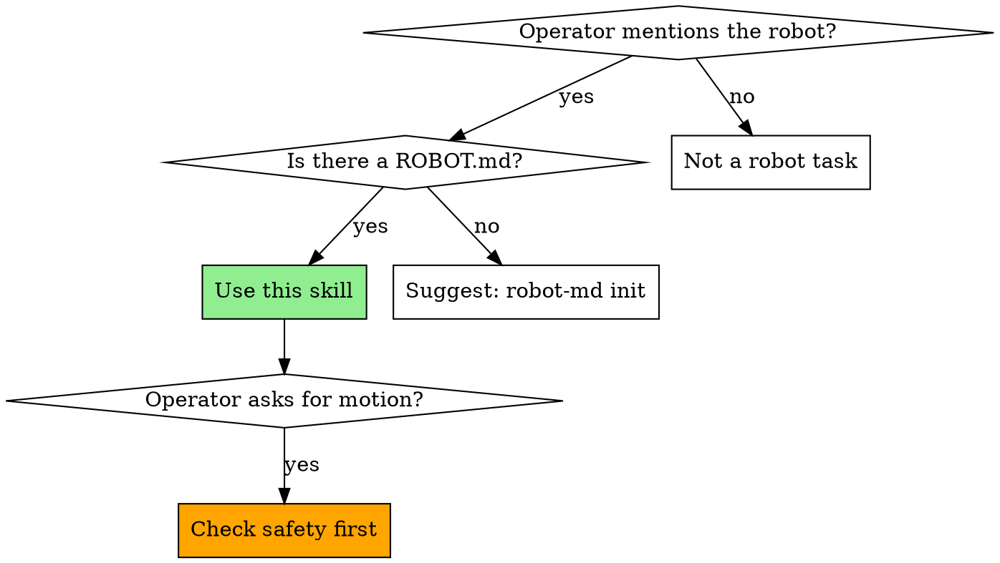

# Using robot-md

## Overview

This project has a `ROBOT.md` at its root — a single-file declaration of what the robot IS and what it CAN DO. `robot-md` is the CLI that reads, validates, renders, diagnoses, calibrates, and registers that file. `robot-md-mcp` is the MCP server that exposes the file to this agent session as resources.

**Core principle:** `ROBOT.md` is authoritative. Never guess what the robot can do or how it's configured. Read the manifest.

**Announce at start:** "I'm using the using-robot-md skill to answer questions about this project's robot."

## When to Use This Skill



## Intent → Action Routing

| Operator says (examples) | You should |
|---|---|
| "What can this robot do?" / "capabilities?" | Read `robot-md://<name>/capabilities` (MCP) or `robot-md render ROBOT.md` |
| "What's it called?" / "what's the RRN?" | Read `robot-md://<name>/identity` (MCP) |
| "Brief me on this robot" / "give me the full context" | Read `robot-md://<name>/context` (MCP) |
| "What are the safety gates?" / "is it safe to X?" | Read `robot-md://<name>/safety` (MCP). **Before any motion, always.** |
| "Pick up X" / "move to Y" / any physical motion | Read `safety` FIRST. If scope matches a gate with `require_auth: true`, pause and ask the operator to authorize. |
| "Something's wrong" / "it won't respond" | Run `robot-md doctor --path ROBOT.md` from Bash |
| "Is the manifest valid?" / "did I break it?" | Call MCP tool `validate`, or run `robot-md validate ROBOT.md` |
| "Quick-check" / "is everything OK" | Call MCP tool `doctor_summary` (manifest-only, fast) |
| "Give me just the YAML" / "dump config" | Call MCP tool `render`, or `robot-md render ROBOT.md` |
| "Set up a new ROBOT.md" (none exists) | `robot-md init <name> --preset <guess> --register --manufacturer <...> --contact-email <...>`. See `docs/getting-started-claude-code.md` in the robot-md repo. |
| "Pose the arm at zero" / "calibrate zero" | `robot-md calibrate --zero ROBOT.md`. Relay interactive prompts to the operator. |
| "Calibrate the hand-eye" / "solve the camera extrinsic" | `robot-md calibrate --hand-eye --marker-pos x,y,z ROBOT.md` |
| "Publish my robot" / "give it a public URL" | `robot-md publish-discovery ROBOT.md --url <URL>` |
| "Register this robot" / "get an RRN" | `robot-md register ROBOT.md --manufacturer ... --contact-email ...` |
| "Unregister" / "take it down" | `robot-md unregister <rrn>` — confirm with operator first (destructive). |

## Safety Protocol

**Before ANY physical motion — no exceptions:**

1. Read `robot-md://<name>/safety` (MCP) or parse `safety:` from the manifest.
2. Scan `hitl_gates[]`. Does the requested scope match one with `require_auth: true`?
3. If yes: stop. Tell the operator the gate requires explicit authorization, name the scope, and wait for them to say "yes, authorize this specific action."
4. If no gate matches and the motion is potentially harmful (grasping unknown objects, high velocity, workspace-boundary-approaching): **surface the gap to the operator**. Don't silently proceed; don't silently decline. Say: "Your manifest doesn't declare a gate for this scope. Add one to ROBOT.md or authorize this specific action."
5. Know the E-stop. `safety.estop.software: true` means a software e-stop exists — learn the driver command for it before attempting motion.

## Prefer MCP over Shell

If `robot-md-mcp` is registered in this session (look for `robot-md://` resources), prefer MCP reads over shelling out — the resources stay in sync with the file on disk automatically, and the server advertises intent-matchable descriptions for each resource.

Check with `/mcp` in Claude Code. If no `robot-md://` resources are present, fall back to `robot-md <verb>` via the Bash tool. (When this skill is installed via the `robot-md` Claude Code plugin, the MCP server is auto-registered — expect the resources to be there.)

## Slash commands (MCP prompts, v0.2.1+)

If `robot-md-mcp >= 0.2.1` is registered, these prompts are available as slash commands — **prefer them** when they match the operator's intent, since they're explicit operator invocations with curated instructions:

| Slash command | When to expect it |
|---|---|
| `/brief-me` | Operator wants an at-a-glance summary of the robot. Invoke when first orienting in a session, or when the operator says "remind me what this robot is". |
| `/check-safety action="<text>"` | **Invoke before any physical motion.** Operator describes the action; the prompt cross-references declared `hitl_gates[]` and returns one of "✓ safe", "⚠ auth required — <gate>", or "⚠ gate gap". |
| `/explain-capability capability="<name>"` | Operator asks about a specific capability like `arm.pick` or `nav.go_to`. Returns what it does, hardware path, and gates that apply. |
| `/manifest-status` | Operator asks for a quick health check. Wraps the `doctor_summary` tool in a human-readable report. |

If the operator hasn't invoked a prompt, you can still proceed via the matching resource/tool — but if a prompt exists for the intent, mention it exists so the operator can invoke it next time.

## Common Mistakes

**Answering from general robotics knowledge**
- **Problem:** You say "a typical SO-ARM101 can lift up to 0.5 kg" when the manifest declares 0.3 kg.
- **Fix:** Read the manifest. The operator's declared values override your priors.

**Skipping the safety read**
- **Problem:** You issue a motion command without first checking `hitl_gates[]`.
- **Fix:** Always read `/safety` before the first motion of a session.

**Proposing a capability not in the list**
- **Problem:** Operator asks "can you pick this up?" and you say yes because it's an arm — but `arm.pick` isn't declared.
- **Fix:** If the capability isn't in `capabilities[]`, the robot can't do it through this interface. Tell the operator.

**Editing metadata.* without asking**
- **Problem:** You edit `metadata.rrn` or `metadata.manufacturer` to match some other convention. The registry entry at rcan.dev now disagrees with the file on disk.
- **Fix:** `metadata.*` is bound to the registry. Don't touch without operator approval — suggest `robot-md register` or `robot-md unregister` + re-register instead.

**Forgetting to validate after an edit**
- **Problem:** You add a new capability or tweak a driver port, then move on. The manifest now fails schema validation silently.
- **Fix:** After any edit to `ROBOT.md`, call the `validate` MCP tool or run `robot-md validate ROBOT.md`.

## Red Flags

**Never:**
- Issue a physical motion command before reading `/safety`
- Invent capabilities not declared in the manifest
- Edit `metadata.rrn`, `metadata.rcan_uri`, or other registry-bound fields without operator confirmation
- Commit files under `~/.robot-md/keys/*` — those are API keys
- Run `robot-md unregister` without the operator typing "unregister"

**Always:**
- Read `robot-md://<name>/safety` before the first motion of the session
- Read `robot-md://<name>/capabilities` before claiming what the robot can do
- Validate after any edit (`validate` MCP tool or `robot-md validate ROBOT.md`)
- Prefer MCP resources over shell-out when the MCP server is registered
- Surface gate-gaps rather than silently proceeding

## Installation

This skill ships as part of the [robot-md](https://github.com/RobotRegistryFoundation/robot-md) repo at `integrations/claude-code-skill/SKILL.md`. To install into a Claude Code session that uses [superpowers](https://github.com/obra/superpowers) (or any skill-aware harness):

```bash
# Copy into your user skills directory
mkdir -p ~/.claude/skills/using-robot-md
cp integrations/claude-code-skill/SKILL.md ~/.claude/skills/using-robot-md/
```

Or install via the superpowers skill-install flow if you use one.

## Integration

**Pairs with:**
- **`robot-md-mcp`** — provides `robot-md://<name>/*` resources + `validate` / `render` / `doctor_summary` tools. Announces its own routing table via the MCP `instructions` field.
- **`CLAUDE.md` in the project root** — generated by `robot-md claude-md ROBOT.md`; encodes the same intent→action table as a plain text file the harness reads at session start.

**Called by:** any session where the operator works on a robot declared by a `ROBOT.md` in the project.
