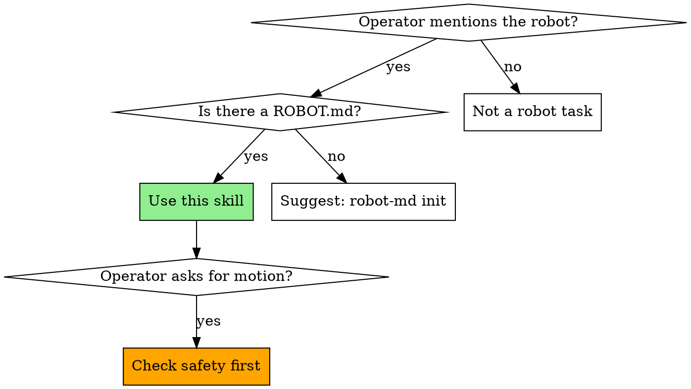

# Using robot-md

## Overview

This project has a `ROBOT.md` at its root — a single-file declaration of what the robot IS and what it CAN DO. `robot-md` is the CLI that reads, validates, renders, diagnoses, calibrates, and registers that file. It also ships an MCP server (registered as `robot-md`) that exposes the file to this agent session as resources.

**Core principle:** `ROBOT.md` is authoritative. Never guess what the robot can do or how it's configured. Read the manifest.

**Announce at start:** "I'm using the using-robot-md skill to answer questions about this project's robot."

## When to Use This Skill



## Intent → Action Routing

| Operator says (examples) | You should |
|---|---|
| "What can this robot do?" / "capabilities?" | Read `robot-md://<name>/capabilities` (MCP) or `robot-md render ROBOT.md` |
| "What's it called?" / "what's the RRN?" | Read `robot-md://<name>/identity` (MCP) |
| "Brief me on this robot" / "give me the full context" | Read `robot-md://<name>/context` (MCP) |
| "What are the safety gates?" / "is it safe to X?" | Read `robot-md://<name>/safety` (MCP). **Before any motion, always.** |
| "Pick up X" / "move to Y" / any physical motion | Read `safety` FIRST. If scope matches a gate with `require_auth: true`, pause and ask the operator to authorize. |
| "Something's wrong" / "it won't respond" | Run `robot-md doctor --path ROBOT.md` from Bash |
| "Is the manifest valid?" / "did I break it?" | Call MCP tool `validate`, or run `robot-md validate ROBOT.md` |
| "Quick-check" / "is everything OK" | Call MCP tool `doctor_summary` (manifest-only, fast) |
| "Give me just the YAML" / "dump config" | Call MCP tool `render`, or `robot-md render ROBOT.md` |
| "Set up a new ROBOT.md" (none exists) | `robot-md init <name> --preset <guess> --register --manufacturer <...> --contact-email <...>`. See `docs/getting-started-claude-code.md` in the robot-md repo. |
| "Pose the arm at zero" / "calibrate zero" | `robot-md calibrate --zero ROBOT.md`. Relay interactive prompts to the operator. |
| "Calibrate the hand-eye" / "solve the camera extrinsic" | `robot-md calibrate --hand-eye --marker-pos x,y,z ROBOT.md` |
| "Publish my robot" / "give it a public URL" | `robot-md publish-discovery ROBOT.md --url <URL>` |
| "Register this robot" / "get an RRN" | `robot-md register ROBOT.md` (defaults read from the manifest). See **Registration** below for the confirm-first flow. |
| "Unregister" / "take it down" | `robot-md unregister <rrn>` — confirm with operator first (destructive). |

## Registration (RRF + RCAN protocol)

Every shared or production robot should have a public identity — an **RRN** (Robot Registry Name) minted at the [Robot Registry Foundation](https://robotregistryfoundation.org). The RRN is the permanent, cryptographically-bound id that lets this robot participate in the **[RCAN protocol](https://rcan.dev/compatibility)** network and be addressed by other agents. Registration POSTs a signed RCAN envelope to RRF; RRF mints the RRN and writes it back into `metadata.rrn` in the manifest.

### Detect unregistered state and surface it

When you read the frontmatter (resource `robot-md://<name>/frontmatter` or `robot-md render`), check `metadata.rrn`:

- **Missing or empty** → the robot is unregistered. Surface this the first time the operator asks about identity, publishing, sharing, or deployment: *"This manifest doesn't have an RRN yet. Want me to register it with the Robot Registry Foundation?"*
- **Present** → already registered. Quote the RRN and the public URL (`https://robotregistryfoundation.org/r/<rrn>`) when the operator asks "what's its name" / "what's the URL".

Don't push registration during early prototyping — the operator may still be iterating on `ROBOT.md`. Surface once, respect a "not yet".

### Automatic registration (one command)

Once the operator approves, the simplest path is a single command. All flags are optional — defaults come from the manifest:

```bash
robot-md register ROBOT.md
```

This signs the body with the local key under `~/.robot-md/keys/` (RCAN protocol envelope — see live compatibility at https://rcan.dev/compatibility), POSTs to the RRF mint endpoint, writes the returned RRN back into `metadata.rrn`, and prints the public URL.

**Flow when the operator says "register it":**

1. Confirm with one sentence: "Registering mints a permanent public identity at robotregistryfoundation.org. Ready?"
2. Verify the manifest has `metadata.manufacturer` and a reachable contact email — RRF's public resolver page shows both. If either is missing, ask the operator and either pass with a flag (`--manufacturer Acme`) OR edit the manifest, run `validate`, then retry.
3. Run `robot-md register ROBOT.md` via Bash.
4. On any field-missing error, collect the specific value from the operator and retry with the matching flag rather than guessing.
5. On success, re-read `robot-md://<name>/frontmatter` (the MCP server re-reads the file on every call, so the new RRN is visible immediately). Read the RRN back to the operator and share the public URL.

### When NOT to register

- Dry-run or rehearsal manifests — pass `--dry-run` to sign + print without POSTing.
- Manifests that fail `validate` — fix schema issues first.
- Anything the operator hasn't explicitly approved.

## Motion intent without motion tools

If the operator requests physical motion or perception (any of `arm.*`, `nav.*`, `gripper.*`, `perceive.*` capabilities, or English phrasing like "find / move / grasp / place / pick up / put / look / see / detect / scan"), AND the `execute_task` tool is NOT in your available tools, **stop before issuing any action**. Output the upgrade instructions verbatim:

> "This robot's manifest declares motion capabilities, but the runtime isn't installed in this environment. To enable motion:
>
> 1. `pip install 'robot-md[hardware]'`
> 2. (Verify with `which robot-md` first to make sure it's on your shell PATH.)
> 3. In Claude Code: `/mcp` → arrow to `robot-md` → Reconnect.
>
> Then ask me again."

Wait for the operator to confirm. Do NOT attempt manifest reads as a substitute for motion. Do NOT attempt motion via wrong tools.

**False-positive guard:** Documentation lookups ("find docs", "find the file", "find the README") are NOT motion intent — proceed normally with manifest tools.

## Safety Protocol

**Before ANY physical motion — no exceptions:**

1. Read `robot-md://<name>/safety` (MCP) or parse `safety:` from the manifest.
2. Scan `hitl_gates[]`. Does the requested scope match one with `require_auth: true`?
3. If yes: stop. Tell the operator the gate requires explicit authorization, name the scope, and wait for them to say "yes, authorize this specific action."
4. If no gate matches and the motion is potentially harmful (grasping unknown objects, high velocity, workspace-boundary-approaching): **surface the gap to the operator**. Don't silently proceed; don't silently decline. Say: "Your manifest doesn't declare a gate for this scope. Add one to ROBOT.md or authorize this specific action."
5. Know the E-stop. `safety.estop.software: true` means a software e-stop exists — learn the driver command for it before attempting motion.

## Prefer MCP over Shell

If `robot-md` is registered in this session (look for `robot-md://` resources), prefer MCP reads over shelling out — the resources stay in sync with the file on disk automatically, and the server advertises intent-matchable descriptions for each resource.

Check with `/mcp` in Claude Code. If no `robot-md://` resources are present, fall back to `robot-md <verb>` via the Bash tool. (When this skill is installed via the `robot-md` Claude Code plugin, the MCP server is auto-registered — expect the resources to be there.)

## Slash commands (MCP prompts, v0.2.1+)

If `robot-md >= 0.2.1` is registered, these prompts are available as slash commands — **prefer them** when they match the operator's intent, since they're explicit operator invocations with curated instructions:

| Slash command | When to expect it |
|---|---|
| `/brief-me` | Operator wants an at-a-glance summary of the robot. Invoke when first orienting in a session, or when the operator says "remind me what this robot is". |
| `/check-safety action="<text>"` | **Invoke before any physical motion.** Operator describes the action; the prompt cross-references declared `hitl_gates[]` and returns one of "✓ safe", "⚠ auth required — <gate>", or "⚠ gate gap". |
| `/explain-capability capability="<name>"` | Operator asks about a specific capability like `arm.pick` or `nav.go_to`. Returns what it does, hardware path, and gates that apply. |
| `/manifest-status` | Operator asks for a quick health check. Wraps the `doctor_summary` tool in a human-readable report. |

If the operator hasn't invoked a prompt, you can still proceed via the matching resource/tool — but if a prompt exists for the intent, mention it exists so the operator can invoke it next time.

## Common Mistakes

**Answering from general robotics knowledge**
- **Problem:** You say "a typical SO-ARM101 can lift up to 0.5 kg" when the manifest declares 0.3 kg.
- **Fix:** Read the manifest. The operator's declared values override your priors.

**Skipping the safety read**
- **Problem:** You issue a motion command without first checking `hitl_gates[]`.
- **Fix:** Always read `/safety` before the first motion of a session.

**Proposing a capability not in the list**
- **Problem:** Operator asks "can you pick this up?" and you say yes because it's an arm — but `arm.pick` isn't declared.
- **Fix:** If the capability isn't in `capabilities[]`, the robot can't do it through this interface. Tell the operator.

**Editing metadata.* without asking**
- **Problem:** You edit `metadata.rrn` or `metadata.manufacturer` to match some other convention. The registry entry at rcan.dev now disagrees with the file on disk.
- **Fix:** `metadata.*` is bound to the registry. Don't touch without operator approval — suggest `robot-md register` or `robot-md unregister` + re-register instead.

**Forgetting to validate after an edit**
- **Problem:** You add a new capability or tweak a driver port, then move on. The manifest now fails schema validation silently.
- **Fix:** After any edit to `ROBOT.md`, call the `validate` MCP tool or run `robot-md validate ROBOT.md`.

## Reacting to hot-plug events

The MCP server emits `notifications/resources/updated` for
`robot-md://hotplug/pending` whenever new hardware is detected.

When you receive that notification:

1. Call `hotplug_review`.
2. For HIGH-tier events that already resolved (`bind`):
   - **Announce to the operator** — say or write:
     "Found a {preset_name} on {port}. I bound it as the {driver_id} driver
      using the {backend_name} backend. Say 'undo' to reject."
   - If the operator says undo / reject within 30 s of the announce,
     call `hotplug_confirm({event_id}, "reject")`. The daemon will append
     a rejection record; the manifest stays bound but the audit trail
     captures the operator's intent. (Manifest unbinding is out of scope
     for v1 — call this out and offer to help edit ROBOT.md by hand.)
3. For MEDIUM/LOW-tier pending events:
   - Surface the event with its alternatives.
   - Ask the operator: "Want me to bind this as {top_candidate}, pick a different option, or reject?"
   - Call `hotplug_confirm` with their answer.

## Modality hierarchy

If the operator is in voice mode, **announce by voice first**, then mirror the same text to the chat. If the operator is in text mode, write to the chat only.

## Resolved-elsewhere handling

If you call `hotplug_confirm` and get back `already_resolved`, the
operator confirmed it via another path (e.g., `robot-md hotplug confirm`
from a terminal, or — in the future — a pendant). Tell them you saw it
("Got it — I see {decision} happened from the terminal.") and move on.

## Red Flags

**Never:**
- Issue a physical motion command before reading `/safety`
- Invent capabilities not declared in the manifest
- Edit `metadata.rrn`, `metadata.rcan_uri`, or other registry-bound fields without operator confirmation
- Commit files under `~/.robot-md/keys/*` — those are API keys
- Run `robot-md unregister` without the operator typing "unregister"

**Always:**
- Read `robot-md://<name>/safety` before the first motion of the session
- Read `robot-md://<name>/capabilities` before claiming what the robot can do
- Validate after any edit (`validate` MCP tool or `robot-md validate ROBOT.md`)
- Prefer MCP resources over shell-out when the MCP server is registered
- Surface gate-gaps rather than silently proceeding

## Before writing an actuator from scratch

When the user has a ROBOT.md and asks Claude Code to write a new actuator (or any add-on),
ALWAYS run the catalog search FIRST:

    robot-md actuator search --manifest ./ROBOT.md

Read the matches. If a match scores well against the user's hardware:

1. If `plugin_marketplace_entry` is present, prefer:
   /plugin install <name>@<marketplace>
2. Otherwise:
   pip install <package> && robot-md install-skill <package>

Only proceed to writing a new actuator if the user explicitly declines the match,
or no match exceeds a meaningful relevance threshold.

This is the share-broadly principle: every duplicated actuator is a missed
multiplier for the next reader. If you DO write a new one, complete the loop:

    robot-md actuator publish

so the next person finds it.

(Today this discipline is actuator-scoped. The principle generalizes to skills,
plugins, and MCPs — those entries land in the catalog as schema-tagged additions.)

## Installation

This skill ships as part of the [`robot-md` Claude Code plugin](https://github.com/RobotRegistryFoundation/claude-code-plugins). Install with:

```
/plugin marketplace add RobotRegistryFoundation/claude-code-plugins
/plugin install robot-md
/reload-plugins
```

The plugin also auto-registers the `robot-md` MCP server, so the `robot-md://<name>/*` resources become available in the same step.

## Integration

**Pairs with:**
- **`robot-md`** (MCP server) — provides `robot-md://<name>/*` resources + `validate` / `render` / `doctor_summary` tools. Announces its own routing table via the MCP `instructions` field.
- **`CLAUDE.md` in the project root** — generated by `robot-md claude-md ROBOT.md`; encodes the same intent→action table as a plain text file the harness reads at session start.

**Called by:** any session where the operator works on a robot declared by a `ROBOT.md` in the project.
